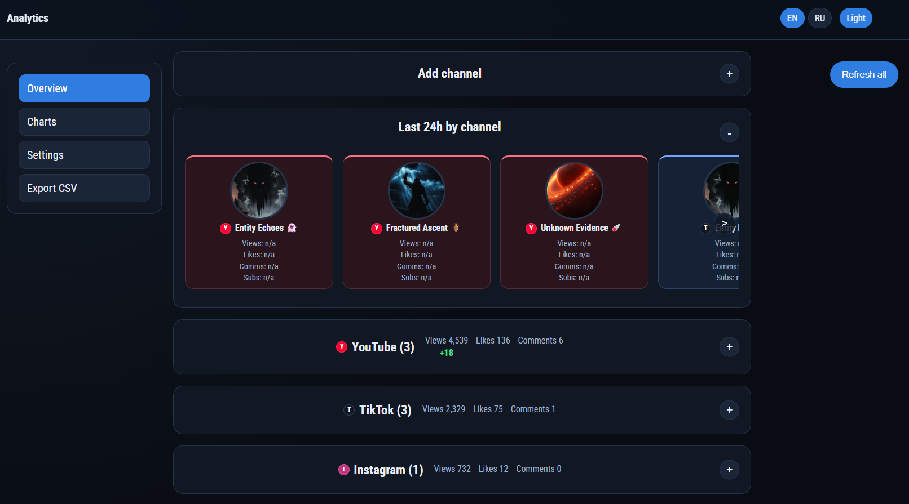
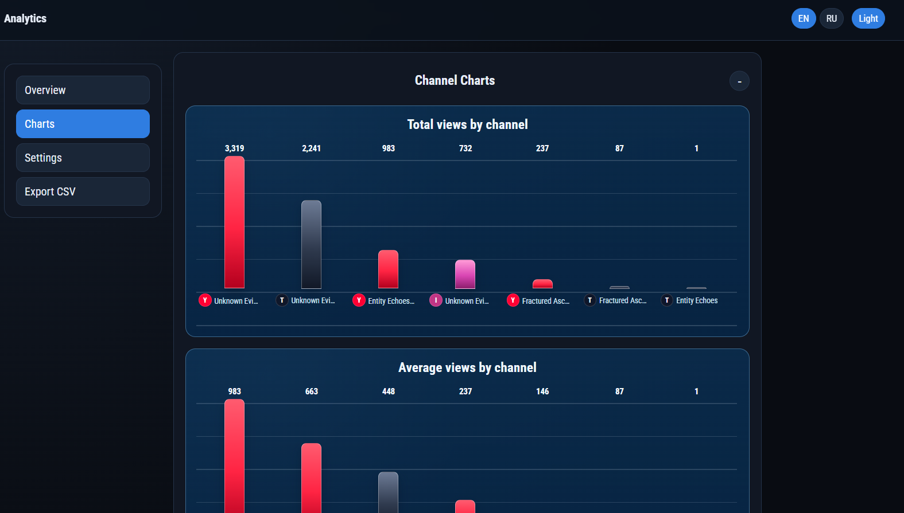
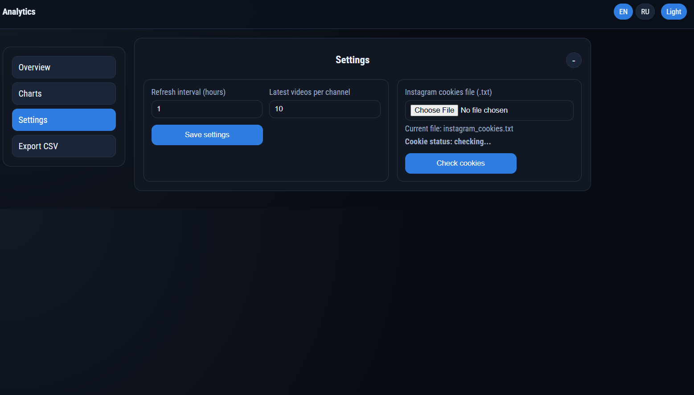
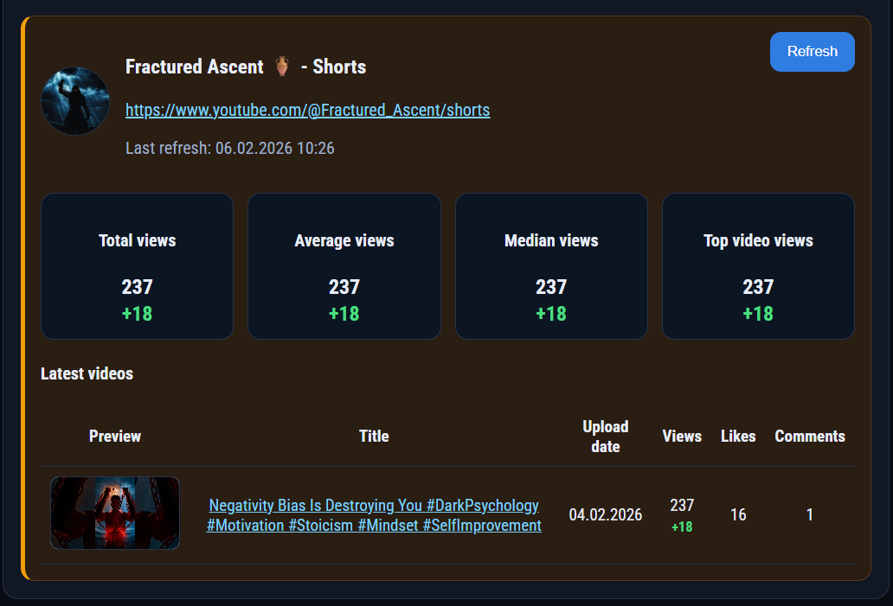
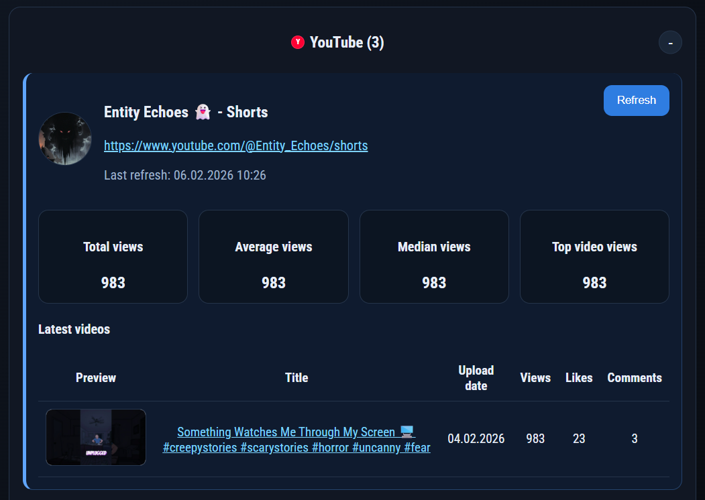

# Shorts Tracker

FastAPI web app for public short-video channel analytics (YouTube, TikTok, Instagram) using `yt-dlp` and platform fallbacks. Data is collected without OAuth/API keys for YouTube/TikTok, Instagram uses cookies (not API keys).

## Features
- FastAPI + Jinja2 templates
- Dashboard with Overview / Charts / Settings
- Add channels by URL (`youtube.com`, `tiktok.com`, `instagram.com`)
- Fetch and store latest N videos per channel in SQLite via SQLModel
- Per-channel metrics:
  - total views
  - average views
  - median views
  - top video views
- Delta metrics after refresh (channel/group/video level)
- Per-channel refresh + global refresh all
- Background refresh job with progress panel and stop action
- Cache guard with forced refresh mode
- Instagram cookies upload + validation from Settings
- Telegram authentication (Login Widget) with private access by allowed Telegram user ID
- Platform grouping and chart visualizations
- CSV export endpoint (`/analytics/export.csv`)
- RU/EN language switch + Light/Dark theme switch

## Supported Platforms
- YouTube
- TikTok
- Instagram

Notes:
- Main data source is `yt-dlp`.
- For unstable platform endpoints, service-level fallbacks are used (especially for TikTok/Instagram scenarios).
- Some channels/videos may not expose likes/comments consistently.

## Screenshots







## Quick Start (Docker)

```bash
git clone https://github.com/svllvsx/shorts_tracker.git
cd shorts_tracker
cp .env.example .env
mkdir -p data/cookies app/static/avatars && touch yt_analytics.db
docker compose up -d --build
docker compose logs -f
```

Open:
- http://127.0.0.1:18080/dashboard

## Docker Deploy On Ubuntu VPS

For full production-like deployment instructions see:
- `DEPLOY_DOCKER_UBUNTU.md`

Included there:
- Docker installation on Ubuntu
- Dockerfile + compose usage
- Persistence strategy for DB/settings/cookies/avatars
- Optional Nginx reverse proxy snippet
- Update and backup commands

## Local Setup (Windows PowerShell)

```powershell
cd C:\Data\Soft\shorts-tracker
python -m venv .venv
.\.venv\Scripts\Activate.ps1
pip install -r requirements.txt
```

Run:

```powershell
uvicorn app.main:app --reload
```

Open in browser:
- http://127.0.0.1:8000/
- Dashboard: http://127.0.0.1:8000/dashboard

## Project Structure

```text
shorts-tracker/
  app/
    services/
      ytdlp_service.py
    static/
      style.css
      avatars/
      favicons/
    templates/
      base.html
      index.html
      dashboard.html
    db.py
    main.py
    models.py
    settings.py
  data/
    cookies/
  settings.toml
  yt_analytics.db
  docker-compose.yml
  Dockerfile
  DEPLOY_DOCKER_UBUNTU.md
  README.md
```

## Settings

`settings.toml` example:

```toml
[app]
refresh_interval_hours = 6
max_videos_per_channel = 12
instagram_cookie_file = "data/cookies/instagram_cookies.txt"
```

`Telegram` secrets should be set in `.env` (root), not in `settings.toml`:

```env
TELEGRAM_BOT_USERNAME=your_bot_username
TELEGRAM_BOT_TOKEN=123456789:replace_with_real_token
TELEGRAM_ALLOWED_USER_ID=123456789
TZ=Europe/Moscow
```

From UI Settings you can:
- upload Instagram cookies file,
- run cookie validation,
- view live cookie status (valid/missing/invalid),
- auto-upload cookies without manual page reload.

Telegram authorization:
- all app routes are protected and redirect to `/login` when not authenticated;
- sign-in uses Telegram Login Widget;
- access is restricted to one configured `TELEGRAM_ALLOWED_USER_ID`;
- Telegram credentials are stored in `.env` (not in `settings.toml`).

## Data Persistence

Runtime data that should not be lost:
- `yt_analytics.db`
- `settings.toml`
- `data/cookies/`
- `app/static/avatars/`

These are already mounted in `docker-compose.yml`.

## Export

CSV export endpoint:
- `GET /analytics/export.csv`

Contains channel-level and video-level analytics columns for each tracked channel.

## Security Notes

- Do not commit cookies, DB, or local runtime cache into git.
- `.gitignore` already excludes sensitive/local data (`.env`, `data/cookies`, DB files, avatars, session log).

## Troubleshooting

- If Instagram fails:
  - re-upload fresh cookies,
  - verify cookies in Settings with the check button,
  - retry refresh.
- If refresh returns little/no data:
  - it can be source-side limits/rate limits/platform changes.
- If Docker container starts but app is unavailable:
  - check `docker compose logs -f`.

## License

No explicit license file is included yet.
If you plan public reuse, add a `LICENSE` file (for example MIT).
